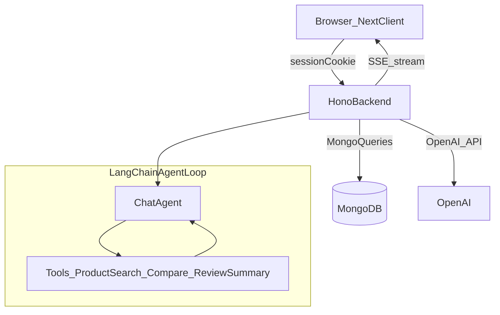

## Current state (from repo)

- Backend is a minimal Hono app with only `GET /` and **does not connect to Mongo** yet.
  - [`apps/backend/src/index.ts`](apps/backend/src/index.ts)
  - Mongo connector exists but is unused: [`apps/backend/src/db/mongo.ts`](apps/backend/src/db/mongo.ts)
- Mongoose models exist for `Product`, `Review`, `Category`, but there are **no APIs** for them yet.
  - [`apps/backend/src/models/product.ts`](apps/backend/src/models/product.ts)
  - [`apps/backend/src/models/review.ts`](apps/backend/src/models/review.ts)
  - [`apps/backend/src/models/category.ts`](apps/backend/src/models/category.ts)
- Client is a Next.js App Router project with a strong shadcn-style UI kit, but **no chat UI** and no API client utilities yet.
  - [`apps/client/app/layout.tsx`](apps/client/app/layout.tsx)

## Target architecture

## Backend implementation (Hono + Bun)

- **Wire Mongo on startup**
  - Update [`apps/backend/src/index.ts`](apps/backend/src/index.ts) to call `connectDB()` from [`apps/backend/src/db/mongo.ts`](apps/backend/src/db/mongo.ts) before serving requests.
  - Add minimal error handling and a health check route (e.g. `GET /healthz`).

- **Add conversation persistence models**
  - Create `Conversation` schema (linked to auth user):
    - `userId: string` (from session)
    - `title?: string` (auto-generated from first message)
    - `createdAt/updatedAt`
  - Create `Message` schema (or embed messages in Conversation; recommendation: separate collection for scalability):
    - `conversationId`
    - `role: 'user'|'assistant'|'tool'|'system'`
    - `content: string`
    - `toolName?: string`, `toolCallId?: string`, `toolArgs?: object`, `toolResult?: object`
    - timestamps

- **Auth integration point (session cookie)**
  - Add an `auth` middleware that reads the session cookie and produces `c.var.userId`.
  - If your session validation lives elsewhere, start with a pluggable interface (e.g. `getUserIdFromRequest(c.req)`), so you can swap in the real session store later.

- **Implement tool backends (these are NOT LLM tools; they are server functions the LLM can call)**
  - Product search (Mongo query builder against `Product` + `Category`):
    - keyword search (name/description)
    - filters: category/subcategory, gender, price range, “latest”, status
    - optional: create a Mongo text index if you want better relevance
  - Product compare:
    - accept two (or N) product identifiers (slug or id)
    - return normalized comparison payload (price, discount, stock, category, description snippets, FAQs)
  - Review summary:
    - fetch reviews for a product
    - compute aggregates (avg, count, distribution)
    - optionally summarize with LLM (or start with purely statistical summary and upgrade later)

- **Build the LangChain agent**
  - Add an `agent` module that:
    - defines LangChain Tools with **strict input schemas** matching the above operations
    - uses OpenAI chat model with tool calling
    - maintains a short memory window from persisted messages (e.g. last 20 messages)
    - records tool calls + results into `Message` documents
  - Standardize agent output to always produce:
    - `assistantMessage` (streamed)
    - optional `suggestedProducts[]` (ids/slugs)

- **Expose agent chat endpoints (SSE streaming)**
  - `POST /api/chat` (body: `{ conversationId?: string, message: string }`)
    - creates conversation if absent
    - stores user message
    - runs agent and streams assistant tokens via SSE
    - final SSE event includes `conversationId` and any structured metadata
  - Conversation management:
    - `GET /api/conversations` (list by `userId`)
    - `GET /api/conversations/:id` (load messages)
    - `DELETE /api/conversations/:id` (optional)

- **CORS + cookies**
  - Because auth uses **session cookies**, configure backend CORS to allow credentials from the client origin.

## Client implementation (Next.js)

- **Create a chat page**
  - Add [`apps/client/app/chat/page.tsx`](apps/client/app/chat/page.tsx) (or make `/` the chat) using existing UI components (`ScrollArea`, `Textarea`, `Button`, `Spinner`, `sonner`).
  - Message bubbles: user vs assistant styling; auto-scroll to bottom.

- **SSE client**
  - Implement an SSE consumer that:
    - `fetch()` POSTs to backend `/api/chat` with `credentials: 'include'`
    - reads the `text/event-stream` response and appends tokens to the assistant message in state
    - supports abort/cancel

- **Chat history UI**
  - Left sidebar (optional) that lists `GET /api/conversations` and allows opening an existing chat.

- **Config**
  - Add `NEXT_PUBLIC_BACKEND_URL` for the client to know where to call.

## Data contracts (high level)

- `POST /api/chat` request:
  - `{ conversationId?: string, message: string }`
- SSE events:
  - `event: token` → `{ delta: string }`
  - `event: metadata` → `{ conversationId: string, suggestedProducts?: string[] }`
  - `event: done` → `{}`

## Risks / quick fixes discovered

- `Product` model references `hasVariants` in conditional `required` functions but that field is not in the schema; we should either add it or remove those conditionals to avoid inconsistent validation.
  - [`apps/backend/src/models/product.ts`](apps/backend/src/models/product.ts)
